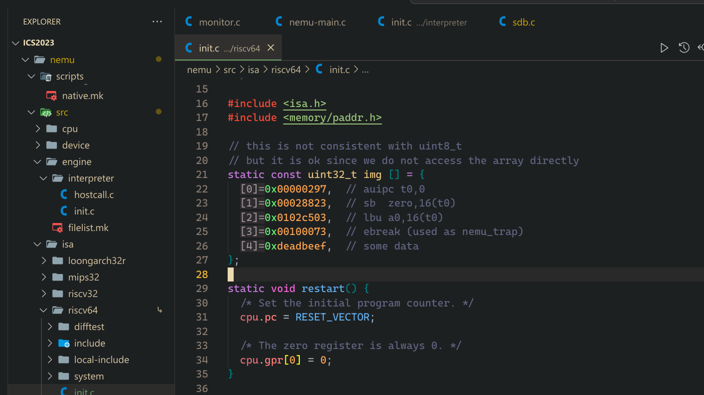

# 框架理解

## 输入`q`程序返回错误码

```shell
make: *** [/home/rick/Projects/ics2023/nemu/scripts/native.mk:38: run] Error 1
```
定位到`native.mk`的位置, 可以发现
```makefile
run: run-env
    $(call git_commit, "run NEMU")
    $(NEMU_EXEC)
```
实际上是程序运行返回了错误码`1`. 进一步检查`main`函数的返回值. 可以发现
```c
int is_exit_status_bad() {
  int good = (nemu_state.state == NEMU_END && nemu_state.halt_ret == 0) ||
    (nemu_state.state == NEMU_QUIT);
  return !good;
}
```
对于`q`的输入应该对应`(nemu_state.state == NEMU_QUIT)`这种情况, 但是实际上没有. 所以定位到`cmd_q`函数添加对`nemu_state`的支持即可. 

### 指示程序结束

`main()` 如何退出的 ? 

## 初始化的指令


这里存放着初始化的指令


## 打印寄存器

这部分主要是寄存器打印, 这里已经提供好宏用于获得cpu的寄存器, 所以直接挨个打印出来就可以. 


## 生成随机表达式

### 如何确定上限? 
实际上我们生成表达式树的时候, 必须要首先预留buffer. 假如当前节点不分裂, 那么必须令pos指针先移动, 再更改buf的内容. 这样, 当最后发现空间不足以分裂的时候, 就直接结束分裂, 并且不会超过最大限制. 
> 那么如何预留呢? 抓住关键点: 每个节点都是整数, 对于32bit的unsigned显然最大需要10字节. 然后如果使用括号, 要多预留两位. 如果选择分裂表达式, 那么要再预留一个10字节出来. 插入空格就选择在表达式前后随机插入. 

### 如何避免除0
这里也很简单, 只需要记录表达式的结果即可. 如果operator是`/`的时候, 发现了0, 那么再次生成一个非0的表达式. 
> 这样想可就大错特错了老弟. 
> 实际上生成过程中是没有办法求值的, 因为我们没有考虑运算符的优先级. 因此如果不运算的确无法避免. 
> 这里我想到一个方法, 使用`-Werror`参数, 直接过滤掉那些有除零错误的代码. 这样的话, 我们完全不考虑任何除0错误, 交给`gcc`来做. 这是一种还不错的方式


## 测试表达式求值

> 这里真的很坏啊, Log宏需要自己开启, 调用`init_log`但是这里默认并不调用; 因此需要我在开始的时候调用, 不然会一直段错误段错误. 但其实是我的, 我这里修改main函数, 希望直接进入表达式测试阶段, 但是跳过了init monitor, 所以就没有init log. 


```shell
./tools/gen-expr/build/gen-expr 5000 | ./build/riscv32-nemu-interpreter | grep -E "FALSE"
```
利用管道我们就可以完成测试. 


## 扩展表达式

> 对于二元运算符, 其实比较显然, 应该没有太大问题. 但是涉及到一个解引用. 

### 处理解引用

```cpp
    // special for deref *, if there is deref,
    // there must deref only, since deref has highest priority
    if (main_op_type == TK_DEREF) {
      word_t const addr = expr_eval(expr, main_op_pos + 1, q, success);
      if (!likely(in_pmem(addr))) {
        Log("[ERROR] address out of bound");
        *success = false;
        return 0;
      } // out of bound
      word_t const read_mem = paddr_read(addr, 4);
      Log("[MEMORY] read from " FMT_WORD ": " FMT_WORD, addr, read_mem);
      return read_mem;
    }
```
如果某个表达式发现操作符是解引用, 那么说明没有其他运算符了, 如果有的话一定会优先选择其他运算符而不是解引用. 

## 监视点

为了方便函数的使用，我们抽象出一个新的头文件`watchpoint.h`. 目的是保证不去多次声明同一个函数签名. 否则在`cpu-exec`中执行扫描监视点的函数的时候, 需要`extern`. 不过其实也差不多

## 为监视点添加`menuconfig`选项

这里遇到一个小问题, `libncurses`动态库无法成功加载. 但是这个库我是有的. 最后定位到`menuconfig`对应的`tools`,  把这个项目在本地重新`make`一遍就好了. 这样在启用`CONFIG_WATCHPOINT`的情况下才会使用监视点. 

## `Debugger - breakpoint` 原理

[这篇文章](https://eli.thegreenplace.net/2011/01/27/how-debuggers-work-part-2-breakpoints)
 
### Setting breakpoints in the debugger with int 3

To set a breakpoint at some target address in the traced process, the debugger does the following:

1. Remember the data stored at the target address
2. Replace the first byte at the target address with the int 3 instruction

Then, when the debugger asks the OS to run the process (with PTRACE_CONT as we saw in the previous article), the process will run and eventually hit upon the int 3, where it will stop and the OS will send it a signal. This is where the debugger comes in again, receiving a signal that its child (or traced process) was stopped. It can then:

1. Replace the int 3 instruction at the target address with the original instruction
2. Roll the instruction pointer of the traced process back by one. This is needed because the instruction pointer now points _after_ the int 3, having already executed it.
3. Allow the user to interact with the process in some way, since the process is still halted at the desired target address. This is the part where your debugger lets you peek at variable values, the call stack and so on.
4. When the user wants to keep running, the debugger will take care of placing the breakpoint back (since it was removed in step 1) at the target address, unless the user asked to cancel the breakpoint.
> 简单来说就是, debugger记得指令是什么, 然后把断点部分的指令第一个byte替换为`int 3`, 然后把`pc`更改到执行之前的状态, 并且把指令换回来; 如果指令继续执行, 那么仍然替换为`int 3`. 

> 还有一个特殊的1字节编码`0xcc`也是`int 3`, 因为有些指令可能就只有一个字节. 如果按照两个字节覆盖, 必然就影响了其他指令. 

## task: get into riscv32

> 我之前做CPU有所涉及的是MIPS ISA, 借助这个机会了解riscv


- riscv32有哪几种指令格式?
> 
> 
> 
- LUI指令的行为是什么?
> 
- mstatus寄存器的结构是怎么样的?


## task: count lines

```shell
find ./ -name "*.h" -o -name "*.c" -exec grep -E ".+" {} \; | count | awk '{total += $1} END {print total}'
```
但是如果在`Makefile`里作为`target`不能这样使用. 